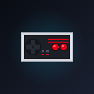

<div align="center">



# RetroROMs

-3DDC84?style=for-the-badge&logo=android&logoColor=white)


-F57C00?style=for-the-badge&logo=sqlite&logoColor=white)


**Нативное Android-приложение для каталогизации, поиска и загрузки ретро-игр с портала [Emu-Land.net](https://www.emu-land.net) с автоматической раскладкой по папкам консолей и умной распаковкой ZIP-архивов.**

[Возможности](#-основные-возможности) • [Платформы](#-поддерживаемые-платформы) • [Архитектура](#-архитектура-и-стек) • [Пайплайн загрузки](#-пайплайн-загрузки-и-распаковки) • [Сборка проекта](#-сборка-и-запуск) • [Roadmap](#-roadmap)

</div>

---

## ✨ Основные возможности

* **📚 Каталог 33 ретро-платформ со скачиваемыми играми:**
  Поддержка всех консолей и портативных систем с портала [Emu-Land.net](https://www.emu-land.net), для которых доступны реальные ROM-файлы и ISO-образы: Dendy / NES, Sega Mega Drive, SNES, Game Boy, GBC, GBA, PlayStation 1, Nintendo 64, PC Engine, 3DO, Atari и многие другие.
* **🔍 Поиск и фильтрация:**
  Мгновенный поиск игр по каталогу платформы или сквозной поиск по всему сайту, фильтрация по популярности, оценкам и алфавиту.
* **📦 Выбор ревизий и версий РОМов:**
  Просмотр всех доступных версий игры (USA, Europe, Japan, фанатские переводы на русский, хаки, пиратские дампы, GoodSet).
* **🗂️ Автоматическая организация на накопителе:**
  * Сохранение игр в системную папку `Download/RetroROMs/<Консоль>/`.
  * Поддержка **Storage Access Framework (SAF)** для выбора любой кастомной директории на внутреннем накопителе или SD-карте.
* **⚡ Умная распаковка ZIP-архивов:**
  * **Single-ROM архивы:** распаковываются сразу в папку соответствующей консоли, а исходный `.zip` удаляется для экономии памяти.
  * **Multi-ROM архивы (GoodSet / сборники):** вызывают диалог `ZipExtractionDialog`, позволяющий отметить только необходимые версии РОМов для извлечения или сохранить ZIP целиком.
* **🖼️ Интерактивный предпросмотр обложек:**
  Долгое нажатие (Long Press) на карточку в сетке или строке списка открывает полноэкранный просмотрщик обложки/скриншота с поддержкой масштабирования (Pinch-to-Zoom) и панорамирования.
* **🎛️ Бегущая строка (Marquee) при взаимодействии:**
  Названия игр отображаются компактно, а при касании к тайлу плавно запускается бегущая строка, предотвращая превращение экрана в хаотичное табло.
* **🎨 Темы оформления (Retro Arcade Themes):**
  Встроенные пресеты (Arcade Neon, Cyberpunk, Retrowave, Game Boy Classic), ручной выбор акцентных цветов через RGB-палитру и переключатель вида каталога (Сетка / Список).

---

## 🕹 Поддерживаемые платформы

В приложении представлено **33 ретро-платформы**, для которых на [Emu-Land.net](https://www.emu-land.net) доступны прямые загрузки ROM-файлов и ISO-образов:

### 📺 Домашние консоли (15 платформ)
| Платформа | Slug | Поколение / Тип | Формат игр |
| :--- | :--- | :--- | :--- |
| **NES / Famicom / Dendy** | `dendy` | 8-bit (1983) | ROMs (.nes) |
| **Sega Mega Drive / Genesis** | `genesis` | 16-bit (1988) | ROMs (.bin, .gen, .smd) |
| **Super Nintendo (SNES)** | `snes` | 16-bit (1990) | ROMs (.smc, .sfc) |
| **Sony PlayStation 1** | `psx` | 32-bit (1994) | ISO (.cue/.bin, .chd) |
| **Nintendo 64** | `n64` | 64-bit (1996) | ROMs (.z64, .n64, .v64) |
| **Sega 32X** | `32x` | 32-bit (1994) | ROMs (.32x) |
| **Sega CD / Mega CD** | `segacd` | 16-bit CD (1991) | Games / ISO (.cue/.bin) |
| **Sega Master System** | `sms` | 8-bit (1985) | ROMs (.sms) |
| **Sega SG-1000** | `sg-1000` | 8-bit (1983) | Games (.sg) |
| **PC Engine / TurboGrafx-16** | `pce` | 16-bit (1987) | ROMs (.pce) |
| **PC Engine CD / TurboGrafx CD** | `pcecd` | 16-bit CD (1988) | Games / ISO (.cue/.bin) |
| **3DO Interactive Multiplayer** | `3do` | 32-bit (1993) | Games / ISO (.iso, .cue) |
| **Famicom Disk System** | `famicom_disk_system` | 8-bit (1986) | Games (.fds) |
| **Neo Geo CD** | `neogeocd` | 16-bit CD (1994) | Games / ISO (.cue/.bin) |
| **Atari Jaguar** | `jaguar` | 64-bit (1993) | ROMs (.j64) |

### 📱 Портативные системы (10 платформ)
| Платформа | Slug | Поколение / Тип | Формат игр |
| :--- | :--- | :--- | :--- |
| **Game Boy Advance** | `gba` | Handheld 32-bit (2001) | ROMs (.gba) |
| **Game Boy** | `gb` | Handheld 8-bit (1989) | Games (.gb) |
| **Game Boy Color** | `gbc` | Handheld 8-bit (1998) | Games (.gbc) |
| **Sega Game Gear** | `gg` | Handheld 8-bit (1990) | ROMs (.gg) |
| **Atari Lynx** | `lynx` | Handheld 16-bit (1989) | ROMs (.lnx) |
| **Neo Geo Pocket** | `ngp` | Handheld 16-bit (1998) | ROMs (.ngp, .ngc) |
| **Bandai WonderSwan** | `ws` | Handheld 16-bit (1999) | ROMs (.ws, .wsc) |
| **Nintendo Virtual Boy** | `vboy` | 32-bit Tabletop (1995) | ROMs (.vb) |
| **Pokémon Mini** | `pmini` | Handheld 8-bit (2001) | ROMs (.min) |
| **Watara Supervision** | `sv` | Handheld 8-bit (1992) | ROMs (.sv) |

### 🕹️ Классические и ранние системы (8 платформ)
| Платформа | Slug | Поколение / Тип | Формат игр |
| :--- | :--- | :--- | :--- |
| **Atari 2600** | `2600` | Classic (1977) | ROMs (.a26) |
| **Atari 5200** | `5200` | Classic (1982) | ROMs (.a52) |
| **Atari 7800** | `7800` | Classic (1986) | ROMs (.a78) |
| **ColecoVision** | `coleco` | Classic (1982) | ROMs (.col) |
| **Vectrex** | `vectrex` | Classic Vector (1982) | ROMs (.vec) |
| **Intellivision** | `intellivision` | Classic (1979) | ROMs (.int) |
| **Emerson Arcadia 2001** | `arcadia` | Classic (1982) | ROMs (.bin) |
| **Fairchild Channel F** | `chaf` | Classic (1976) | ROMs (.chf) |

> 💡 **Исключённые платформы (без РОМов на сайте):**  
> Платформы, на страницах которых на Emu-Land отсутствуют скачиваемые архивы игр (такие как **Nintendo DS, Nintendo 3DS, Nintendo Wii, Wii U, Sony PSP, PS2, PS3, Sega Dreamcast, Sega Saturn, Xbox, Xbox 360**), намеренно исключены из каталога приложения. Это гарантирует, что пользователь видит только те системы, где действительно можно скачивать игры.

---

## 🛠 Архитектура и стек

Приложение построено в строгом соответствии с рекомендациями **Android Modern Architecture (MVVM + Repository + Unidirectional Data Flow)**:

```
┌────────────────────────────────────────────────────────┐
│                   Jetpack Compose UI                   │
│  (MainActivity, HomeScreen, GameCardItem, Dialogs)     │
└───────────────────────────▲────────────────────────────┘
                            │ StateFlow / Events
┌───────────────────────────┴────────────────────────────┐
│                    EmuLandViewModel                    │
│   (State management, Coroutine scopes, Preferences)    │
└───────────────────────────▲────────────────────────────┘
                            │ Suspend functions / Flow
┌───────────────────────────┴────────────────────────────┐
│                   EmuLandRepository                    │
│        (Координация локального кэша и сети)            │
└─────────────┬───────────────────────────┬──────────────┘
              │                           │
              ▼                           ▼
┌───────────────────────────┐ ┌──────────────────────────┐
│       Room Database       │ │      Сетевой слой        │
│  (GameDao, ConsoleDao,    │ │  • EmuLandScraper (Jsoup)│
│       DownloadDao)        │ │  • RomDownloader (OkHttp)│
│         (SQLite)          │ │  • java.util.zip (Zip)   │
└───────────────────────────┘ └──────────────────────────┘
```

### Ключевые библиотеки

| Библиотека | Назначение |
| :--- | :--- |
| **Jetpack Compose BOM 2024.09.00** | Декларативный UI на базе Material Design 3 |
| **Room 2.7.0 (KSP 2.3.5)** | Локальная реляционная база данных SQLite с поддержкой Flow |
| **OkHttp 4.10.0** | Потоковая загрузка бинарных ROM-файлов, управление таймаутами и заголовками |
| **Jsoup 1.18.3** | Парсинг HTML-страниц Emu-Land.net, извлечение метаданных и прямых ссылок `getmfl` |
| **Coil Compose 2.7.0** | Асинхронная загрузка и кэширование обложек и скриншотов |
| **Kotlin Coroutines & Flow 1.10.2** | Асинхронное программирование и реактивное управление состоянием |
| **DocumentFile (SAF)** | Поддержка пользовательских папок для сохранения РОМов |

---

## 📁 Структура проекта

```
app/src/main/java/com/example/
├── MainActivity.kt                  # Корневая Activity, хост навигации и глобальных диалогов
├── model/
│   └── Models.kt                    # Data-классы: GameCard, RomFileVersion, ZipExtractionRequest и др.
├── data/
│   ├── local/
│   │   ├── AppDatabase.kt           # Room Database определение
│   │   ├── Entities.kt              # Таблицы Room: ConsoleEntity, GameEntity, DownloadEntity
│   │   └── Daos.kt                  # DAO интерфейсы с запросами и Flow
│   ├── remote/
│   │   └── EmuLandScraper.kt        # HTML-парсер каталога, AJAX getmfl и резолвер прямых ссылок
│   ├── downloader/
│   │   └── RomDownloader.kt         # Менеджер загрузки, ZipFile анализ, распаковка, SAF/MediaStore
│   └── repository/
│       └── EmuLandRepository.kt     # Единая точка доступа к данным (Repository pattern)
├── ui/
│   ├── components/
│   │   ├── GameCardItem.kt          # Карточка игры для сетки (компактная, 185 dp, Marquee, Long Click)
│   │   ├── GameListItem.kt          # Элемент игры для списка (52 dp, Long Click по всей строке)
│   │   └── FullScreenImageDialog.kt # Полноэкранный просмотрщик обложек с Pinch-to-Zoom
│   ├── screens/
│   │   ├── HomeScreen.kt            # Главный экран каталога с табами, фильтрами и пагинацией
│   │   ├── GameDetailSheet.kt       # Модальная карточка деталей игры
│   │   ├── RomVersionsSheet.kt      # Шторка выбора ревизий/версий РОМа
│   │   ├── ZipExtractionDialog.kt   # Интерактивный выбор РОМов из многофайлового архива
│   │   ├── DownloadsScreen.kt       # Экран менеджера загрузок и настроек хранилища/распаковки
│   │   ├── FavoritesScreen.kt       # Экран избранных игр
│   │   └── SettingsDialog.kt        # Настройки отображаемых платформ и темы
│   ├── theme/
│   │   ├── Color.kt / Theme.kt      # Палитра цветов Arcade Dark и M3 Theming
│   │   └── ThemePreferences.kt      # Управление пресетами и пользовательскими цветами
│   └── viewmodel/
│       └── EmuLandViewModel.kt      # Главный ViewModel приложения
```

---

## 🚀 Пайплайн загрузки и распаковки

1. **Резолвинг ссылки:** Приложение отправляет запрос к AJAX-эндпоинту Emu-Land `act=getmfl` с валидными заголовками `Referer` и десктопным `User-Agent`.
2. **Временное сохранение:** Поток байтов сохраняется во временный файл в `context.cacheDir` с регулярным отчетом о прогрессе в UI и базу Room.
3. **Анализ содержимого:**
   * Если файл не является ZIP-архивом или авто-распаковка выключена в настройках — файл переносится в целевую папку консоли как есть.
   * Если файл является ZIP-архивом:
     * **1 РОМ внутри:** архив распаковывается напрямую в папку консоли, временный ZIP удаляется, статус обновляется на `COMPLETED`.
     * **>1 РОМа внутри:** выводится `ZipExtractionDialog`. Пользователь отмечает нужные файлы, после чего извлекаются только они, а временный ZIP удаляется.

---

## 🔨 Сборка и запуск

### Требования
* Android Studio Ladybug / Koala или новее.
* JDK 17 или JDK 21.
* Android SDK 35 (Build-tools 35.0.0).

### Сборка через терминал
```bash
# Клонирование репозитория
git clone https://github.com/<ваш-аккаунт>/RetroROMs.git
cd RetroROMs

# Запуск юнит-тестов
gradle testDebugUnitTest

# Сборка Debug APK
gradle assembleDebug
```
Собранный файл будет находиться в `app/build/outputs/apk/debug/app-debug.apk`.

---

## 🗺 Roadmap

- [x] Каталог игр Emu-Land с пагинацией и оффлайн-кэшированием в Room.
- [x] Поиск игр и фильтрация по платформам/категориям.
- [x] Выбор конкретной версии/перевода игры.
- [x] Поддержка Storage Access Framework (SAF) для любых директорий.
- [x] Автоматическая распаковка single-ROM ZIP-архивов с удалением архива.
- [x] Интерактивный диалог выбора файлов для multi-ROM архивов.
- [x] Полноэкранный просмотр обложек по долгому нажатию.
- [x] Бегущие строки (Marquee) при взаимодействии с тайлом.
- [x] Фильтрация каталога: отображение только систем с доступными для скачивания РОМами (33 системы).
- [x] Динамический парсинг категорий и алфавитных фильтров из блока `#pagelist_top` сайта.
- [ ] Поддержка распаковки `.7z`-архивов.
- [ ] Запуск скачанных РОМов в установленных на устройстве эмуляторах через Android Intent (`ACTION_VIEW`).
- [ ] Очередь параллельных загрузок с паузой/возобновлением.
- [ ] Проверка контрольных сумм РОМов (CRC32/MD5) по базам No-Intro.

---

## 📄 Лицензия и дисклеймер

Данный проект разработан исключительно в образовательных целях и в целях сохранения ретро-игрового наследия (Retro Gaming Preservation). Все метаданные, обложки и файлы игр предоставляются порталом [Emu-Land.net](https://www.emu-land.net). Права на игры принадлежат их законным правообладателям.
